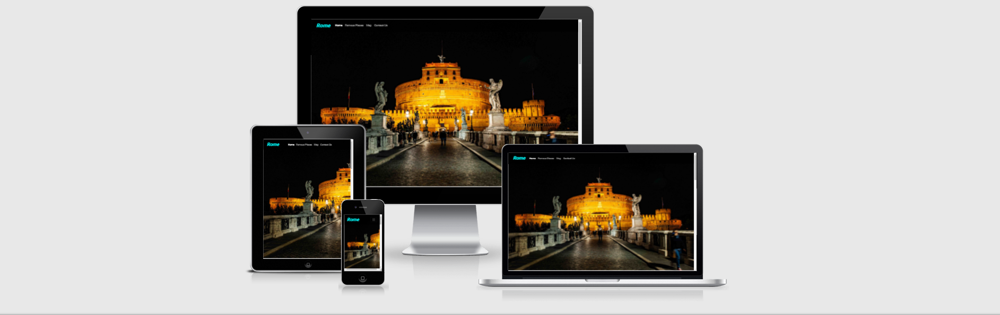

# Rome

This is a "Rome" lading page for Italian capital visitors. On this site, users can find useful information about famous places in Rome. 
There is short text content besides famous places images. Also on the site is a map with recommended places for Rome visitors. 
They are famous places, hotels, restaurants, bars. In the map are markers with the real coordinates of the place, that will showplace that is visitor has to see. 
This interactive website was created for a non-existing travel guide.
# UX

who this website for...
what it is that they want to achiev...
how this project is the best way to help them achieve these things.

## User Stories

* As a user type, I want to perform an action, so that I can achieve a goal.
* As a user of the website, I would like to that website will be responsive, that I can use it from any device.
* As a user of the website, I would like to see a user-friendly website with normal color contrasts, handy navigation bar.
* As a user of the website, I would like to contact the website admin, for my personal questions.
* As a user of the website, I would like to see the map of the city.
* As a user of the website, I would like to see the markers in the map for recommended places to visit, to plan my journey.
* As a user of the website, I would like to see in the marker of the map, useful information about places with links to their own sites.
* As a user of the website, I would like to see recommended hotels for city visitors, where I can stay.
* As a user of the website, I would like to see recommended restaurants for city visitors, where I can visit to taste Italian kitchen.
* As a user of the website, I would like to see recommended bars for city visitors, where I can spend little entertainment time. 
* As a user of the website, I would like to see the website's social media links, to see the comments, or find some more information from the others visitors to the city.

## Wireframes

Home Page

Famous places

Map

Contact Us Form 

All Page

## Mockups

## Diagrams?

# Features
this setion I should go over the different parts of project, describe each section in sentense or so.

## Existing Features
 * Feature 1 - allows users X to achieve Y, by having them fill out Z.
 
 In additional, I use this section to discuss plans for additional features to be 
 implemented in the future:

 ## Features Left to implemented
 *Another feature idea

 # Technologie Used

 * [HTML5](https://en.wikipedia.org/wiki/HTML5) - provides the content and structure for website.
 * [CSS](https://en.wikipedia.org/wiki/CSS) - provides the styling.
 * [jQuery](https://jquery.com/) - was used for website interactives.
 * [JavaScript](https://en.wikipedia.org/wiki/JavaScript) - was used to create Google map on the site.
 * [Gitpod](https://www.gitpod.io/) - used for write the all code, commited, pushed to the GitHub.
 * [GitHub](https://github.com/) - used for hosting this code and deployment.
 * [Grammarly](https://app.grammarly.com/) - was used for check typo.

### Design

* [Bootstrap](https://getbootstrap.com/) - framework was used to create the layout for all of the page. Also used it for grid system, 
navbar, trainer cards, sign up / sign in and contact us forms.
* [Fontawesom](https://fontawesome.com/) - used for style the social media links and used in timetable.
* [Google Fonts](https://fonts.google.com/) - used Ubuntu fonts.

### Testing

* [Markup Validation Service](https://validator.w3.org/) - used for tested html code.
* [CSS validation service](https://jigsaw.w3.org/css-validator/) - used for tested css code.
* [Responsive Design](http://ami.responsivedesign.is/#) - checked website responsive.
* [Chrome DevTools](https://developers.google.com/web/tools/chrome-devtools/) - used for testing and found new ideas, it's like in sandbox.

 # Testing

 ## Testing User Stories

 The user looking for some information about Rome.  famous places, camming to this website
  , clicking on the navigation link, find famous places, clicking the the read more button, 
  read short text content about place. 

  User looking for information on the map in this website, clicking on the map link or scrolling 
  down, find map. Tahn interesting on the map markers, see that a lot markers and they close each together.

  User click on the markers and get useful information, that can make plan for day activities.

  User are interestet about trip, want to contact to site admin for paln to trip, goes to 
  navigation link Contact Us. Form is opened. Than user have to fill in all fields before sumited, 
  becouse form has required attribute. 

  When the user send the request for some questions, admin get email from him with the name 
  and email link to send him answers. They have conversation about trip.

 # Deployment

 The websited is hosted on my Github page.

### Deployment steps:
1. Navigate to my **GitHub** repository - [https://github.com/andrius-siup/visit-rome.git](https://github.com/andrius-siup/visit-rome.git) . 
1. Go to the **Settings** tab of the top page.
1. Scroll down to the **GitHub Pages** section.
1. Make sure the source is **master branch**, saved it.
1. After selecting **master branch** the page will refresh.
1. Scroll down, back to the **GitHub Pages** section and you will see a link that saying **"Your site is published"** with the link.
1. Now you can **click the link** and go to the published website.

### Cloning Steps:
1. Navigate to my repository - [https://github.com/andrius-siup/visit-rome.git](https://github.com/andrius-siup/visit-rome.git) .
1. Click the **Code** button.
1. To clone with **HTTPS** copy the URL in the box [https://github.com/andrius-siup/visit-rome.git](https://github.com/andrius-siup/visit-rome.git) .
1. Open your IDE.
1. Changed the directory to the location you want to clone to be made.
1. Type **git clone** then paste the copied URL.
1. Press enter and clone will be created.   

### Download
1. Navigate to my repository - [https://github.com/andrius-siup/visit-rome.git](https://github.com/andrius-siup/visit-rome.git) .
1. Click the **Code** button.
1. Click the **Download Zip**, it will be downloaded zip folder.
1. Extract where you want to keep all files.

## Author

The website was created by Andrius Siupinys.

 # Credits

 ## Content
 * All text content was be taken from Google and edited for website purposes.

 ## Media
 * The photo used on the home page in this site were obtained from [Unsplash](https://unsplash.com/photos/vnv6nKdtqLc) website.
 * The photo used for the visit to St. Peter's Basilica in this site was obtained from [shutterstock](https://www.shutterstock.com/image-photo/st-peters-basilica-evening-via-della-1218983827) website.
 * The photo used for the visit to Coloseum in this site was obtained from [shutterstock](https://www.shutterstock.com/image-photo/sunrise-view-colosseum-rome-italy-architecture-789412159) website.
 * The photo used for the visit to Trevi Fountain in this site was obtained from [Unsplash](https://unsplash.com/photos/pbBeTkp97ic) website.
 
 

 ## Acknowledgements
 * I received inspiration for this project from X...

 * Brian Macharia - mentor support, huge help through the project.
 * Slack community - help for solve code isues.

